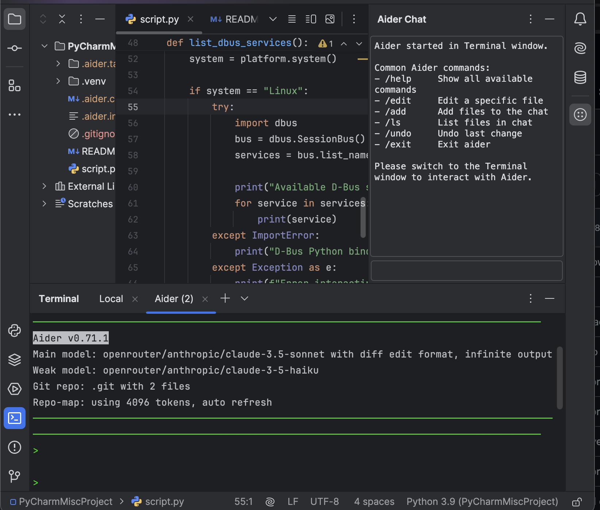

# Aider PyCharm Plugin

A PyCharm plugin that integrates [Aider](https://aider.chat), an AI pair programming tool, directly into your IDE.

## Features

- Launch Aider chat sessions directly from PyCharm
- Configure Aider settings through PyCharm's settings interface
- Dedicated tool window for Aider interactions
- Seamless integration with your existing PyCharm workflow




## Installation

### From JetBrains Marketplace (Recommended)
1. Open PyCharm
2. Go to Settings/Preferences → Plugins
3. Click "Browse repositories..."
4. Search for "Aider"
5. Click "Install"
6. Restart PyCharm

### Latest Development Build
You can download the latest development build from our [GitHub Releases](https://github.com/vadika/aider-pycharm-plugin/releases/tag/latest).
To install:
1. Open PyCharm
2. Go to Settings/Preferences → Plugins
3. Click the gear icon and select "Install Plugin from Disk..."
4. Navigate to the downloaded .zip file and select it
5. Restart PyCharm

Note: Development builds may be unstable and are recommended for testing purposes only.

## Requirements

- PyCharm 2023.1 or later
- Aider CLI tool installed (`pip install aider-chat`)
- OpenAI API key configured

## Usage

1. Configure your Aider settings in PyCharm preferences
2. Open the Aider tool window (View → Tool Windows → Aider)
3. Start coding with AI assistance!

## Configuration

Access Aider settings through:
- Settings/Preferences → Tools → Aider Settings
- Or use the gear icon in the Aider tool window

## License

This project is licensed under the MIT License - see the LICENSE file for details.

## Building from Source

1. Clone the repository:
   ```bash
   git clone https://github.com/yourusername/aider-pycharm-plugin.git
   cd aider-pycharm-plugin
   ```

2. Build using Gradle:
   ```bash
   ./gradlew build
   ```

3. The plugin will be built to:
   `build/distributions/aider-pycharm-plugin-1.0-SNAPSHOT.zip`

4. To run/debug in a development instance of PyCharm:
   ```bash
   ./gradlew runIde
   ```

## Contributing

Contributions are welcome! Please feel free to submit a Pull Request.

### Development Requirements
- JDK 17 or later
- Gradle (included via wrapper)
- PyCharm CE/Pro 2023.1+
